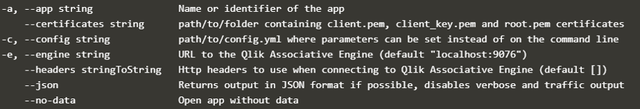

**Tip** Run `corectl` in the terminal window to see corectls CLI commands: 
`corectl`{{execute}}

## 1. CoreCtl build
There are two ways to use `corectl build`:
 

**Configurations file**
 The simplest way that we will use in this tutorial is to use a configuration file.  
When you run the command: `corectl build`{{execute}} CoreCtl will look for file with the name ***corectl.yml*** in the current folder. In the corectl.yml file its possible to setup basic configuration for corectl for instance: engine connection details, app and objects.  

Look a the specification of how to create the [**corectl configuration file**](https://github.com/qlik-oss/corectl/blob/master/docs/corectl_config.md), this is were you will find most **solutions** to the exercises this tutorial. 
 

**Flags**
 The second way you can build corectl is with providing flags to the `corectl build`{{execute}} command.
 

## 2. Exercise: Connect corectl to engine

Edit the `corectl.yml`{{open}} so that is connects to engine.

 
Show solution

 
<pre class="file" data-target="clipboard">engine: localhost:19076 # URL and port to running Qlik Associative Engine instance
</pre>

  
 

 Use `corectl build`{{open}} to rebuild the application 
  

 Use `corectl build`{{open}} to rebuild the application 
 That will return `ERROR no app specified`.
  

 ## 3. Exercise: Create an app

 Edit the `corectl.yml`{{open}} and specify an app you want to use.

 
 
Show solution

 
 
<pre class="file" data-target="clipboard">engine: localhost:19076 # URL and port to running Qlik Associative Engine instance
app: /myapp.qvf   # App name that the tool should open a session against.
</pre>

This can also be done using a flag:
 

`corectl build -a "my app"`{{execute}}

  

Now you should have an up and running against an engine.  
You can check your apps with:    
`corectl app ls`{{execute}}
 
 
However this app is empty, in next step we will load data to the app.

## 4. Running build with flags

To use the same setup as in the config file we have to use the flags:
* `-e`{{execute}} which specifies URL to QIX engine and *-a* which 
* `-a`{{execute}} which specifies the app name of the app
 

Something like this:  
`corectl build -e "localhost:19076" -a "myapp.qvf"`{{execute}}