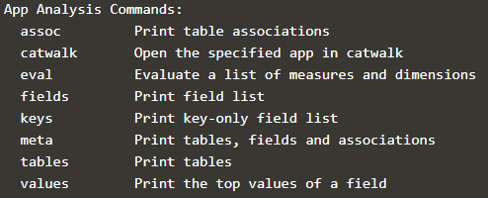

In this step we will load data into the app.<br> 

Again look at the (https://github.com/qlik-oss/corectl/blob/master/docs/corectl_config.md)
Again we will edit the `corectl.yml`{{open}} file but we also need a **load script**: <br>

* `testscript.qvs`{{open}} - A load script that will be used in *Step 3* to load data. 

and **some data**:
* `data/movie.cvs `{{open}} - The data that will be loaded, contains information about 10 movies. 
**OBS** This data is loaded into a volume in a docker container, the internal docker container is /data. If you are curios about the docker file check it out here `../docker-compose.yml`{{open}} 
## 1. Edit the corectl.yml to load data
To be able to load data you will:
1. need to define what load script you want to used. 
2. Then you will need to expose a connection from the engine container to the load script.

<br>

**1. Exercise: Add the script**

  Edit the `corectl.yml`{{open}} file so that it uses the `testscript.qvs` loadscript.

<details> <summary>Show solution</summary>
<p> 
<pre class="file" data-target="clipboard">
engine: localhost:19076 # URL and port to running Qlik Associative Engine instance
app: /myapp.qvf   # App name that the tool should open a session against.
script: testscript.qvs # Path to a script that should be set in the app
</pre>
</p>
</details>  

**2. Exercise: Expose a connection**  
  Edit the `corectl.yml`{{open}} so that it opens the connection `testdata` to the `folder` `/data` with in the engine container.

<details> <summary>Show solution</summary>
<p> 
<pre class="file" data-target="clipboard">
engine: localhost:19076 # URL and port to running Qlik Associative Engine instance
app: /myapp.qvf   # App name that the tool should open a session against.
script: testscript.qvs # Path to a script that should be set in the app
connections: # Connections that should be created in the app
  testdata: # Name of the connection
      connectionstring: /data # Connectionstring (qConnectionString) of the connection. For a folder connector this is an absolute or relative path inside of the engine docker container.
      type: folder # Type of connection

</pre>
</p>
</details>  
<br>

**Connection setup examples**

The load script can only load data from the exposed connections specified in the `corectl.yml`{{open}}. 
```yml
connections: # Connections that should be created in the app
  testdata: # Name of the exposed connection
      connectionstring: /data # Connectionstring (qConnectionString) of the connection. For a folder connector this is an absolute or relative path inside of the engine docker container.
      type: folder # Type of connection
```
In this example the exposed connections will be `testdata`. 
<br>

Another **example**. 
```yml
connections: # Connections that should be created in the app
 testdata: #Name of firsrt the connection
      connectionstring: /data # Connectionstring (qConnectionString) of the connection. For a folder connector this is an absolute or relative path inside of the engine docker container.
      type: folder # Type of connection
  webdata: # Name of the second connection
    connectionstring: "https://gist.githubusercontent.com/carlioth/b86ede12e75b5756c9f34c0d65a22bb3/raw/e733b74c7c1c5494669b36893a31de5427b7b4fc/MovieInfo.csv" # Connectionstring (qConnectionString) of the connection. For a folder connector this is an absolute or relative path inside of the engine docker container.
    type: internet # Type of connection
 
```
This would expose two connection:<br>
The first connection is the same as in the other example. <br> The second one is a webdata connection to a gist on github.


## 2. The load script
First take a look at `testscript.qvs`{{open}}. If you are familiar with SQL you will see some similarities this is because when the load scripts once were made they were inspired by SQL. 
<br>


`
Movies:  
LOAD *
FROM [lib://testdata/movies.csv]
(txt, utf8, embedded labels, delimiter is ',');
`

This script will load everything from `movies.cvs` at the exposed connection lib://testdata/. <br>
lib is a specification when the data is from a local source in this case the engine container.
<br>Depending on what data source, the load scripts will be different. 
<br>

**Load different kinds of file types**<br>
Read about [core data loading](https://github.com/qlik-oss/core-data-loading) to learn how to load different file types. 


## 3. Analyze the data with coreCtl

We have now loaded `data/movie.cvs `{{open}} into our myapp.qvf app. There are a bunch of analytics tool we can use on the loaded data.
<br>
To see the analysis tools: `corectl`{{execute}} and under `App Analysis Commands` you will find the useful tools.
<br>



**For example:**
<br>

`corectl fields`{{execute}} - Displays the fields in the app
<br>

`corectl tables`{{execute}} - Displays tables in the app
<br>

`corectl values <field name>`{{execute}} - Displays the values in the specific field
<br>

From `corectl fields`{{execute}} we see that the app contains a field called Movie. By us
ing `corectl values Movie`{{execute}} we can se tha values of the Movie field.
<br>

>>As you can see there are more two more fields in our data tables, can you use `corectl fields` to figure out how many of the movies that were made in 2009?<<
[ ] One
[*] Two
[ ] Three


## 4. Catwalk
After you have created the initial load script, chances are that you experience data modeling problems. In such cases, you may need help finding out how the data is associated and how interactions with the data impacts the model.

Catwalk provides you with a view of all your tables, fields, their associations as well as information about the data within.

When running corectl locally on your machine you can use `corectl catwalk`{{execute}} to run catwalk in a browser. 
<br>
Since this katacoda environment has no inbuilt browser you will have to manually enter the app [websocket url](https://catwalk.core.qlik.com/?engine_url=). If you are running a engine container on your local machine the websocket will be `ws://localhost:19076` depending on what port you use.

We have configure the websocket URL for this example:

 [**Catwalk for this tutorial!**](https://catwalk.core.qlik.com/?engine_url=wss://[[HOST_SUBDOMAIN]]-19076-[[KATACODA_HOST]].environments.katacoda.com/home/engine/Qlik/Sense/Apps/myapp.qvf) 

However since we have load just a small .cvs file into our app the catwalk wont help us much. But when the data structures get bigger and more complex catwalk can be a really useful tool.<br>
If you are curious about catwalk you can be utilize with more complex data take a look at[catwalk weather data example](https://catwalk.core.qlik.com/?engine_url=wss://apps.core.qlik.com/app/doc/01775889-c700-413f-9b0e-6ba1837c52b0/).

**Next step**
<br> In next step we will use an object to structure the data.